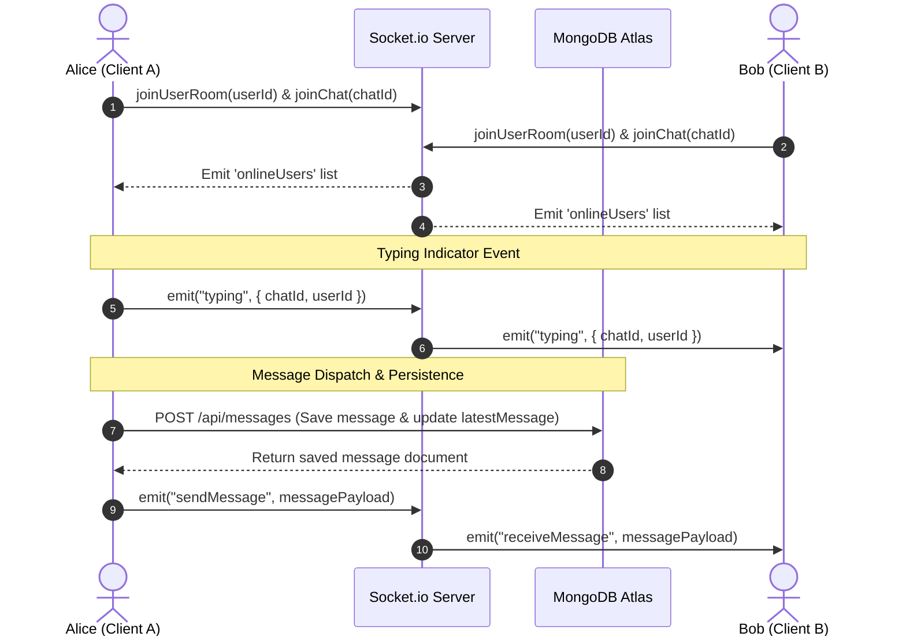

# Chatify — Full-Stack Real-Time Communication Platform

[](https://nextjs.org/)
[](https://www.typescriptlang.org/)
[](https://socket.io/)
[](https://www.mongodb.com/atlas)
[](https://tailwindcss.com/)
[](https://next-auth.js.org/)

Chatify is a high-concurrency, event-driven real-time messaging web application engineered with **Next.js (App Router)**, **TypeScript**, **Node.js**, **Socket.io**, and **MongoDB Atlas**. It features instant 1-on-1 chats, multi-user groups with granular admin permissions, live typing status, online/offline presence tracking, media sharing with client-side canvas compression, and private username routing.

---

## Architecture & System Design

```mermaid
flowchart TD
    subgraph Clients["Client Layer (Web & Mobile)"]
        BrowserA["Web Client (User A)"]
        MobileB["Mobile Client (User B)"]
    end

    subgraph Frontend["Vercel Serverless Hosting"]
        NextApp["Next.js App Router (UI & API Routes)"]
        AuthHandler["NextAuth.js (JWT Session)"]
        MediaHandler["Avatar & Media API (/api/users/avatar)"]
    end

    subgraph Realtime["Render / Railway Service"]
        SocketServer["Node.js + Socket.io Server"]
        RoomManager["Room & Presence Manager"]
    end

    subgraph Database["Database Layer"]
        MongoAtlas[("MongoDB Atlas Cluster")]
        UsersCol[("users")]
        ChatsCol[("chats")]
        MessagesCol[("messages")]
    end

    BrowserA <-->|HTTPS / REST API| NextApp
    MobileB <-->|HTTPS / REST API| NextApp
    BrowserA <-->|WSS (WebSockets)| SocketServer
    MobileB <-->|WSS (WebSockets)| SocketServer

    NextApp -->|Mongoose ODM| MongoAtlas
    SocketServer -->|Broadcast Events| RoomManager
    RoomManager -->|Sync Online Status / Typing| BrowserA
    RoomManager -->|Sync Online Status / Typing| MobileB
    NextApp --- AuthHandler
    NextApp --- MediaHandler
    MongoAtlas --- UsersCol
    MongoAtlas --- ChatsCol
    MongoAtlas --- MessagesCol
```

---

## Real-Time Messaging & Event Flow



---

## Key Features

- **Real-Time Bidirectional Messaging**: Built on WebSockets via Socket.io with heartbeat mechanisms and automatic reconnection fallback for low-latency full-duplex communication.
- **Group Chat Lifecycle & Governance**: Full group management including role-based administration, member addition/removal, group renaming, and audit history tracking (`memberHistory`).
- **Live User Presence & Typing State**: Instant online/offline status broadcast across active socket rooms, complete with debounced typing indicators.
- **Optimized Media & Avatar Pipeline**: Client-side canvas downsampling and compression (reducing image payloads by up to 95% before upload), paired with dedicated binary image streaming endpoints (`/api/users/avatar/[userId]`) and HTTP caching headers (`Cache-Control: public, max-age=86400`) to eliminate cookie bloat and HTTP 494 errors.
- **Robust Security Architecture**:
  - Encrypted JWT session tokens managed through NextAuth.js.
  - Password hashing utilizing `bcryptjs` with salt rounds.
  - Constant-time authentication error reporting to prevent username enumeration attacks.
  - Strict Cross-Origin Resource Sharing (CORS) filtering on WebSocket connections.
  - Sensitive username separation (usernames used strictly for discovery and credentials, never exposed publicly in chat windows).
- **Mobile-Responsive UI & Theming**: Dynamic viewport height (`100dvh`) styling, responsive navigation drawers, light/dark theme switching, and real-time unread badges.

---

## Tech Stack

| Domain | Technologies |
| :--- | :--- |
| **Frontend** | Next.js 15 (App Router), React 19, TypeScript, Tailwind CSS, Lucide Icons |
| **Real-Time Server** | Node.js, Express, Socket.io (WebSocket + Long-Polling Fallback) |
| **Database & ODM** | MongoDB Atlas, Mongoose ODM |
| **Authentication** | NextAuth.js (JWT Strategy), bcryptjs |
| **Deployment** | Vercel (Frontend & Serverless APIs), Render / Railway (Socket.io Service) |

---

## Directory Structure

```text
├── app/
│   ├── (auth)/             # Login & Signup pages
│   ├── api/
│   │   ├── auth/           # NextAuth & registration endpoints
│   │   ├── chats/          # 1-on-1 and Group chat CRUD operations
│   │   ├── messages/       # Message persistence & retrieval
│   │   ├── upload/         # Media handling endpoint
│   │   └── users/          # Profile management & avatar streaming
│   ├── layout.tsx          # Root layout & session/theme providers
│   └── page.tsx            # Main chat application entrypoint
├── components/
│   └── chat/               # ChatList, ChatWindow, ProfileModal, GroupInfoDrawer
├── hooks/
│   └── useSocket.ts        # Reusable Socket.io connection & event hook
├── lib/
│   ├── auth.ts             # NextAuth configuration & lightweight JWT callbacks
│   ├── db.ts               # Cached MongoDB connection utility
│   └── socket.ts           # Client-side Socket.io singleton
├── models/                 # Mongoose schemas (User, Chat, Message)
└── server/
    └── index.ts            # Standalone Socket.io server with CORS & room management
```

---

## Getting Started

### Prerequisites

- **Node.js** >= 18.0.0
- **npm** or **yarn**
- **MongoDB Atlas** database URI

### 1. Clone the repository
```bash
git clone https://github.com/tanishmutta2005/chatify.git
cd chatify
```

### 2. Install dependencies
```bash
npm install
```

### 3. Configure Environment Variables
Create a `.env.local` file in the root directory:
```env
# MongoDB Atlas Connection String
MONGODB_URI=mongodb+srv://<username>:<password>@cluster.mongodb.net/chatify?retryWrites=true&w=majority

# NextAuth Configuration
NEXTAUTH_SECRET=your_super_secure_random_secret_string
NEXTAUTH_URL=http://localhost:3000

# Socket Server URL
NEXT_PUBLIC_SOCKET_URL=http://localhost:5001
```

### 4. Run the Development Environment

**Start the Next.js Frontend:**
```bash
npm run dev
```

**Start the Socket Server (in a separate terminal):**
```bash
npm run server
```

Open [http://localhost:3000](http://localhost:3000) in your browser to start chatting.

---

## License
Distributed under the MIT License.
